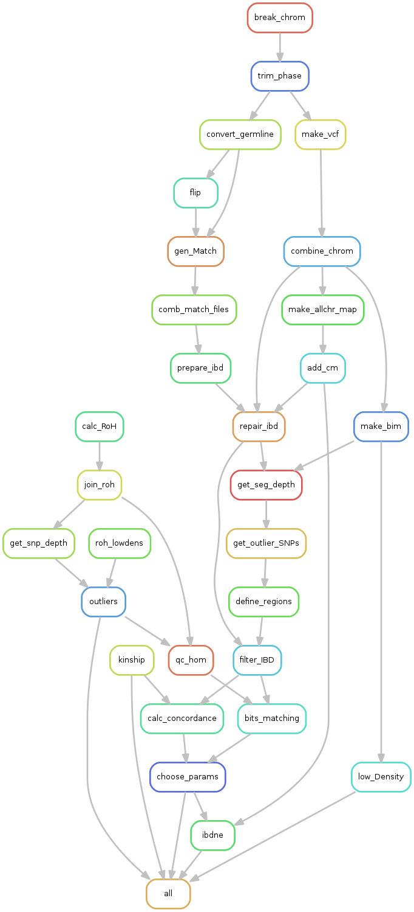

# snake-IBDne
Repo for running custom snakemake for IBDne.

Citations for programs in pipeline:

`merge-ibd-segments.16May19.ad5.jar` and `ibdne.07May18.6a4.jar`:

B L Browning and S R Browning (2013). Improving the accuracy and efficiency of identity-by-descent detection in   population data. Genetics 194(2):459-71. doi:10.1534/genetics.113.150029

# Running snake-IBDne

### Project Folder

Please run each dataset in its own separate folder for clarity.

```bash
/share/hennlab/projects/snake-IBDNe/
```

### Required software:
- snakemake
- shapeit v2.r904
- R 3.6.1
- plink2 1.90p
- GERMLINE2
- ibdne.07May18.6a4.jar (download from [here](https://faculty.washington.edu/browning/ibdne.html#download) )
- merge-ibd-segments.16May19.ad5.jar

### Setting up conda environment

1. For Henn lab users: run this command every time before you use conda:
```bash
source /share/hennlab/progs/miniconda3/etc/profile.d/conda.sh
```

2. To create the environment:
```bash
conda create -n IBDne-env r-base shapeit plink scipy python=2.7 r-biocmanager
```
You only need to create the environment the first time, after that you just go straight to the next step (activate it)

3. To activate the environment: (every time you run pipeline)
```bash
conda activate IBDne-env
```
Installing required r-packages: (once only, when setting up the environment)
```bash
conda install -c bioconda bioconductor-genomicranges
conda install -c r r-data.table
```

4. Once inside the environment, you must manually add the following programs to your path (before each run of the pipeline):
```bash
export PATH="/share/hennlab/progs/GERMLINE2-master:$PATH"
```
### Required files in working directory: (Please note - you must run each population in its own directory.)

- data folder with input data:
    - if data is NOT phased yet: the data folder must contain bim, bed, fam files named in the format {dataset}.bim /bed/fam
    - if data IS phased already: the data folder must contain plink .haps, .sample files for individual chromosomes named in the format {dataset}.chr{chrnum}.phased.haps /.sample
- regions folder with exclude_regions_hg19.txt
- scripts folder with the following required scripts:
     - bits_matching.sh
     - calc_genome_length.R
     - calculate_concordance.sh
     - choose_params.sh
     - combine_chrom.sh
     - comb_match_files.sh
     - compare_IBD_kinship.R
     - compare_RoH.R
     - define_regions.sh
     - filter_RoH-IBD_segs.R
     - find_lowDensityRegs.R
     - get_outlier_regions.R
     - get_outlier_SNPs.R
     - get_seg_depthv3.R
     - join_RoHsegs.R
     - shapeit_to_germline.py
     - trim_bimfile.R
     - shapeit_iterate.sh
- progs folder with the following java programs:
     - merge-ibd-segments.16May19.ad5.jar
     - ibdne.07May18.6a4.jar
- Snakefile
     - the file entitled "ibdne_2versions.smk" is an alternative snakefile for comparing different versions of ibdne. Please use "Snakefile" for regular runs of the pipeline

### How to run:

The snakemake command must be run with four config parameters
- dataset: filename of initial QC'ed bim/bed/fam files (without file extension)
      ex: if the files are named "Himba_merged.bim" then set dataset=Himba_merged
- phased: FALSE if input data is not phased, TRUE if input data is phased.
- gmap-chr_dir: directory containing plink format recombination maps for separate chromosomes
    - filenames MUST be named in the format chr{chrnum}.gmap.txt
- ref: file prefix of the reference population 1000G .haps.gz, .legend, .sample, excluding the _chr{chrnum} portion
    - example: if the files are titled
    `1000GP_Phase3/1000GP_Phase3_chr6.hap.gz`
    `1000GP_Phase3/1000GP_Phase3_chr6.legend` and
    `1000GP_Phase3/1000GP_Phase3.sample`
    provide the command line argument as such: `ref=1000GP_Phase3/1000GP_Phase3`
    note that the .hap and .legend files must be named with `_chr{number}.hap.gz` and `_chr{number}.legend` following the prefix you provide in the ref command line option
    - Data downloaded from this link : https://mathgen.stats.ox.ac.uk/impute/1000GP_Phase3.html Data downloaded from this link
    - For Henn lab users: location of these files is `/share/hennlab/reference/1000G_Phase3_haps-sample-legend/`

Example:
```bash

### Dry run - testing workflow
/share/hennlab/progs/miniconda3/bin/snakemake -n --config dataset=xal phased=TRUE ref=/share/hennlab/reference/1000G_Phase3_haps-sample-legend/1000GP_Phase3/1000GP_Phase3 gmap_chr_dir=/share/hennlab/projects/snake-IBDNe/austin_files/ -p -j 10

## Generate DAG of pipeline
/share/hennlab/progs/miniconda3/bin/snakemake --config dataset=xal phased=TRUE ref=/share/hennlab/reference/1000G_Phase3_haps-sample-legend/1000GP_Phase3/1000GP_Phase3 gmap_chr_dir=/share/hennlab/projects/snake-IBDNe/austin_files/ --rulegraph | dot -Tpng > rulegraph.png

## Run the pipeline!
/share/hennlab/progs/miniconda3/bin/snakemake  --config dataset=xal phased=TRUE ref=/share/hennlab/reference/1000G_Phase3_haps-sample-legend/1000GP_Phase3/1000GP_Phase3 gmap_chr_dir=/share/hennlab/projects/Xal_snake-IBDne/austin_files/ -p -j 20

```
### Pipeline Overview




## Running ibdne_2versions.smk

This snakefile will output results from two versions of IBDne (ibdne.23Apr20.ae9.jar and ibdne.04Sep15.e78.jar) for comparison. To run this version, add the flag `-s ibdne_2versions.smk`
